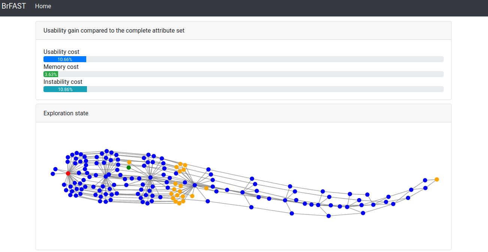

BrFAST (Browser Fingerprinting Attribute Selection Tool)
========================================================

<!-- Screenshot of BrFAST -->



<!-- Table of Contents -->
<details open="open">
  <summary>Table of Contents</summary>
  <ol>
    <li>
      <a href="#about-the-project">About The Project</a>
      <ul>
        <li><a href="#built-with">Built With</a></li>
      </ul>
    </li>
    <li>
      <a href="#getting-started">Getting Started</a>
      <ul>
        <li><a href="#prerequisites">Prerequisites</a></li>
        <li><a href="#installation">Installation</a></li>
      </ul>
    </li>
    <li>
      <a href="#usages">Usages</a>
      <ul>
        <li><a href="#preparing-the-publicly-available-fingerprint-datasets">Preparing the publicly available fingerprint datasets</a>
        <li><a href="#measuring-the-usability-cost-of-the-attributes">Measuring the usability cost of the attributes</a></li>
        <li><a href="#running-brfast-from-the-command-line">Running BrFAST from the command line</a></li>
        <li><a href="#displaying-the-visualization-of-brfast-as-a-web-application">Displaying the visualization of BrFAST as a web application</a></li>
        <li><a href="#testing-code-coverage-and-documentation-generation">Testing, code coverage and documentation generation</a></li>
      </ul>
    </li>
    <li><a href="#architecture">Architecture</a></li>
    <li><a href="#roadmap">Roadmap</a></li>
    <li><a href="#license">License</a></li>
    <li><a href="#contact">Contact</a></li>
  </ol>
</details>


## About The Project

<!-- Description of the objective of this repository -->
This repository hosts BrFAST, our Browser Fingerprinting Attribute Selection
Tool that we developed to demonstrate our method of attribute selection named
FPSelect. You can read
[our publication about FPSelect](https://doi.org/10.1145/3427228.3427297)
which is also available on [arXiv](https://arxiv.org/abs/2010.06404) and
[HAL](https://hal.archives-ouvertes.fr/hal-02965948).

<!-- How this repository works -->
BrFAST takes the form of a command line and a web application that you can use
to select the attributes to implement in your browser fingerprinting probe.


### Built With

- [Modin](https://modin.readthedocs.io) help us to distribute the fingerprint
  analysis.
- [Flask](https://flask.palletsprojects.com) is the framework with which the
  web application is built.
- [Bootstrap](https://getbootstrap.com) help us make beautiful web pages
  without too much effort.
- [D3JS](https://d3js.org) is used for the visualization of the exploration of
  the possibilities displayed as a graph.


## Getting Started

### Prerequisites

BrFAST is developed in [Python3](https://www.python.org/downloads) for which
you should have a version installed on your system. BrFAST was tested on
**Python3.8** and **does not work (for now) on Python3.9** due to a lack of
support of some libraries.


### Installation

1. Clone this repository.
   ```sh
   git clone https://github.com/tandriamil/BrFAST
   ```
2. Create a virtual environment (not mandatory but recommended).
   ```sh
   # The virtual environment is created in a directory named "venv"
   python3 -m venv venv
   ```
3. Enter the scope of the virtual environment.
   ```sh
   source venv/bin/activate
   ```
4. Install the dependencies.
   ```sh
   pip install -r requirements.txt
   ```
5. Copy the `config.ini.template` to `config.ini` to use the default
   configuration. You can edit this file to meet your needs.
   ```sh
   cp config.ini.template config.ini
   ```


## Usages

You can find below the several usages of BrFAST. Please execute the scripts
once in the virtual environment with the dependencies installed.


### Preparing the publicly available fingerprint datasets

To use the two publicly available browser fingerprint datasets, we provide the
necessary assets and instructions in
[executables/dataset/readme.md](executables/dataset/readme.md).


### Measuring the usability cost of the attributes

We pre-compute the usability cost of the attributes and provide these results
to our usability cost measures. The scripts to measure these usability costs
are in the `executables/measures` directory. We also provide the resulting
measures in the `assets/data/[dataset]-measures` directories.

**Average attribute size**

To compute the average size of the attributes of a fingerprint dataset:
```sh
python -m executables.measures.memory input_dataset output_file
```

- `input_dataset`: The path to the browser fingerprint dataset as a csv file.
- `output_file`: The path where to save the results to as a csv file.

**Average attribute instability**

To compute the average instability of the attributes of a fingerprint dataset:
```sh
python -m executables.measures.instability input_dataset output_file
```

- `input_dataset`: The path to the browser fingerprint dataset as a csv file.
- `output_file`: The path where to save the results to as a csv file.


### Running BrFAST from the command line

The scripts to run BrFAST from the command line are in the
`executables/experiments` directory.

**Simple dummy example**

The simple dummy example runs the example shown in our FPSelect paper. All the
data that is used and the measures are hard-written in the code. You can still
execute it to check that BrFAST runs fine.

```sh
python -m executables.experiments.dummy_fpselect_example
```

**A single execution**

The script named `single_execution.py` processes a single execution:

```sh
python -m executables.experiments.single_execution [options] input_data_dir
```

The required positional argument `input_data_dir` should point to a directory
that contains the data named as:
- `fingerprints.csv` for the browser fingerprint dataset file.
- `memory.csv` for the average size of each attribute.
- `instability.csv` for the proportion of changes of each attribute.

You can use the optional arguments to specify the parameters:
- `-m [selection_method]`: The attribute selection method among `fpselect` (the
                           default one), `entropy`, and `conditional_entropy`.
- `-t [threshold]`: The sensitivity threshold (default is `0.10`).
- `-k [submissions]`: The number of submissions by the considered attacker.
                      This is the `k` used to measure the proportion of the
                      users that share the `k` most common fingerprints
                      (default is `4`).
- `-o [trace_file]`: The path where to save the trace file if this option is
                     set.
- `-p [paths]`: The number of paths explored in the lattice of the possibilities
                by FPSelect (default is `3`).
- `--no-pruning`: Prevent from using the pruning methods of FPSelect.

The script is configured to the use following measures for the sensitivity and
the usability cost. You can copy and edit this script to use other implemented
measures or your owns.
- The sensitivity measure used is `TopKFingerprints` which computes the
  sensitivity as the proportion of the users that share the top-k fingerprints.
- The usability cost measure is `MemoryInstability` which measures the average
  size and number of changing attributes from the browser fingerprints.

**Multiple executions**

The script named `multiple_executions.py` processes multiple executions.

```sh
python -m executables.experiments.multiple_executions
```

It takes a list of values for each parameter and processes the exploration
considering the Cartesian product of the values of each parameter. You must at
least edit the `BASE_PATH` and check the `DATA_DIRECTORIES` directories.

The input directories should contain the same files as for the single
execution. The same sensitivity and usability cost measures as for the single
execution are used.

The resulting traces of these executions are written in the same directory as
the input directory of an execution. The name of a trace is composed of the
attribute selection method, the sensitivity threshold, the number of submissions
by the attacker, and the weights of the usability costs, separated by dashes.


### Displaying the visualization of BrFAST as a web application

BrFAST includes a visualization tool that takes the form of a web application.
For now, you can only visualize the replay of an execution trace obtained from
a command line execution, but we plan to include a real-time visualization in
the future. To replay an execution trace, here are the steps:

1. Set the Flask environment variables:
  ```sh
  export FLASK_APP=brfast.webserver.application
  # The following is optional and shows verbose logs when errors are encountered
  # export FLASK_ENV=debug
  # The following is optional and reloads the application after each edit
  # export FLASK_ENV=development
  ```
2. Run the Flask application:
  ```sh
  python -m flask run
  # You can specify a port if you run several applications
  # python -m flask run --port 5001
  ```
3. Open you web browser to the [default home page](http://127.0.0.1:5000).
4. Choose to replay a trace.
5. Provide a trace file (required), the corresponding fingerprint dataset
   (optional), and send the files. You can find traces in the
   `assets/data/[dataset]-traces` directories.

The visualization of the replay page is then displayed with
- The parameters of the execution from which the trace was saved.
- The current state of the exploration with the best solution currently
  found.
- The usability gain as the usability cost of the best solution as a
  percentage of the usability cost of the candidate attributes (i.e., the
  complete set of attributes).
- The visualization of the exploration with the explored attribute sets. Those
  that were explored are in blue, the starting empty set is in red, those that
  were pruned are in orange, and those that satisfy the sensitivity threshold
  are in green.
- Passing the mouse over an attribute set shows its information, and clicking
  on it opens a new tab with additional information about this attribute set.


### Testing, code coverage and documentation generation

You can execute the tests by:

```sh
python -m unittest discover -s tests
```

You can generate the coverage report in `htmlcol` (open `index.html`) by:

```sh
coverage run -m unittest discover -s tests
coverage html
```

You can generate the documentation in `html` (open `brfast/index.html`) by:

```sh
pdoc --html brfast
```


## Architecture

Below, we describe the content of each module of this project.

### assets

The `assets` directory contains assets related to BrFAST.
- `architecture.md` describes the architecture of the `brfast` module.
- `data` contains the results of the usability cost measures and traces of  
  execution for the two publicly available browser fingerprint datasets.

### brfast

The `brfast` directory contains the BrFAST module written in Python3.
- `exploration` contains the interfaces and the implementations of the
  exploration algorithms.
- `measures` contains the interfaces and the implementations of the different
  measures used by BrFAST.
- `utils` contains utility functions used by BrFAST.
- `data.py` contains the interfaces and the implementations related to the data
  types manipulated by BrFAST.
- `webserver` contains the web server application of BrFAST.


## Roadmap

The attribute selection tool is under development on a private repository. This
one is a public mirror that will include the features when they are ready. The
features to come are listed below.

- [x] Implementation of a sensitivity measure by the proportion of the users
  that share the most common fingerprints.
- [x] Implementation of a usability cost measure that captures the size and
  the instability of the generated fingerprints.
- [x] Implementation of the usual attribute selection methods that rely on the
  entropy and the conditional entropy.
- [x] Inclusion of the resources necessary to use the publicly available
  fingerprint datasets of
  [FPStalker](https://github.com/Spirals-Team/FPStalker) and
  [HTillmann](https://www.henning-tillmann.de/2013/10/browser-fingerprinting-93-der-nutzer-hinterlassen-eindeutige-spuren).
- [x] Implementation of the replay of an execution trace with the explored attribute sets as a graph using the D3JS library.
- [x] Implementation of the visualization of the information on the generated
  fingerprints given an attribute set, displaying their sensitivity, their
  usability cost, and a sample of the resulting fingerprints.
- [ ] Implementation of the visualization of a real time exploration.
- [ ] Add more insights into the attribute sets: their unicity, their entropy,
  their stability, and so on.


## License

Distributed under the MIT License. See the `LICENSE` file for more information.


## Contact

[Nampoina Andriamilanto](https://tandriamil.fr) - tompo.andri [at] gmail [dot]
com
