evaluateBrFAST - Architecture
=====================

## Dataset and exploration mode

The replay mode does not require a dataset, but requires a trace to replay.

|                 | Real time mode | Replay mode                             |
|-----------------|----------------|-----------------------------------------|
| With dataset    | Exploration :heavy_check_mark:, analysis :heavy_check_mark: | Exploration :heavy_check_mark:, analysis :heavy_check_mark: |
| Without dataset | Exploration :x:, analysis :x: | Exploration :heavy_check_mark:, analysis :x: |

## UML Diagram

```puml
@startuml

package brfast {

  package brfast.exploration {
    class Exploration {
      + parameters: Dict[str, Any]

      + init(sensitivity: SensitivityMeasure, usability_cost: UsabilityCostMeasure, dataset: FingerprintDataset, sensitivity_threshold: float)
      + {abstract} run()
      + get_solution(): AttributeSet
      + get_explored_attribute_sets(): List[AttributeSet]
      + get_satisfying_attribute_sets(): Set[AttributeSet]
      + save_exploration_trace(save_path: str)
    }

    package brfast.exploration.entropy {
      class Entropy

      Exploration <|-- Entropy
    }

    package brfast.exploration.conditional_entropy {
      class ConditionalEntropy

      Exploration <|-- ConditionalEntropy
    }

    package brfast.exploration.fpselect {
      class FPSelect {
        + init(sensitivity_measure: SensitivityMeasure, usability_cost_measure: UsabilityCostMeasure, dataset: FingerprintDataset, sensitivity_threshold: float, explored_paths: int, pruning: bool)
      }

      Exploration <|-- FPSelect
    }
  }

  package brfast.measures {
    abstract class SensitivityMeasure {
      + {abstract} evaluate(attr_set: AttributeSet) : float
    }

    abstract class UsabilityCostMeasure {
      + {abstract} evaluate(attr_set: AttributeSet) : Tuple[float, Dict[str, float]]
    }

    package brfast.measures.sensitivity.fpselect {
      class TopKFingerprints {
        + init(fingerprint_dataset: FingerprintDataset, most_common_fps: int)
      }

      SensitivityMeasure <|-- TopKFingerprints
    }

    package brfast.measures.usability_cost.fpselect {
      class MemoryInstability {
        + init(size: Dict[Attribute, float], instability: Dict[Attribute, float], weights: Dict[str, float])
      }

      class MemoryInstabilityTime {
        + init(size: Dict[Attribute, float], instability: Dict[Attribute, float], time: Dict[Attribute, Tuple[float, bool]], weights: Dict[str, float])
      }

      UsabilityCostMeasure <|-- MemoryInstability
      MemoryInstability <|-- MemoryInstabilityTime
    }

    Exploration --> SensitivityMeasure : sensitivity {RO}
    Exploration --> UsabilityCostMeasure : usability_cost {RO}
  }

  package brfast.data {
    class Attribute {
      + attr_id: int {RO}
      + name: str {RO}

      + init(attr_id: int, name: str)
    }

    class AttributeSet {
      + attribute_ids: List[int] {RO}
      + attribute_names: List[str] {RO}

      + init(attributes: Iterable[Attribute])
      + add(attribute: Attribute)
      + remove(attribute: Attribute)
      + issuperset(attribute_set: AttributeSet): bool
      + issubset(attribute_set: AttributeSet): bool
      + get_attribute_by_id(attr_id: int): Attribute
      + get_attribute_by_name(name: str): Attribute
    }

    abstract class FingerprintDataset {
      + dataset_path: str {RO}
      + dataset: pandas.core.frame.DataFrame {RO}

      + init(dataset_path: str)
      ~ {abstract} _process_dataset()
      ~ {abstract} _set_candidate_attributes()
    }

    Exploration --> FingerprintDataset : dataset {RO}
    FingerprintDataset --> AttributeSet : candidate_attributes {RO}
    AttributeSet o-- Attribute
  }
}

@enduml
```

